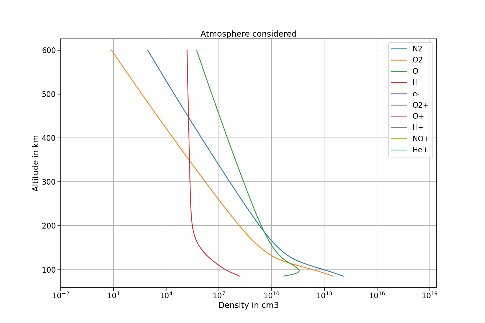
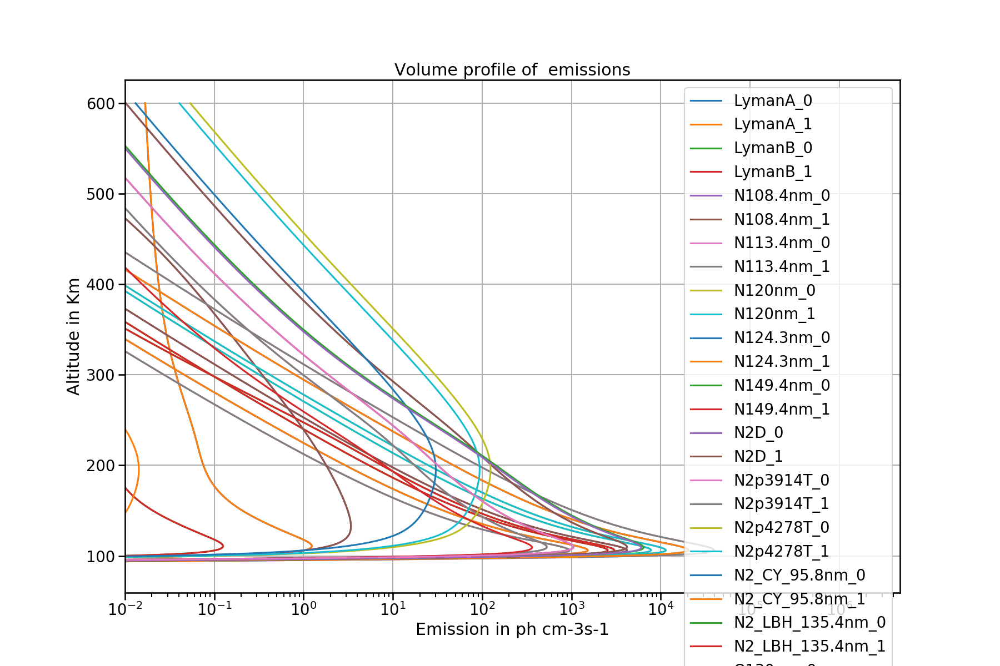
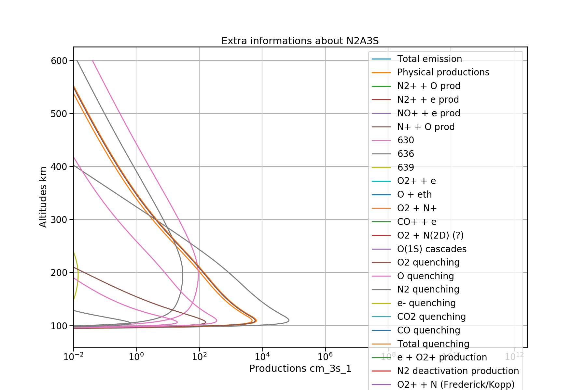
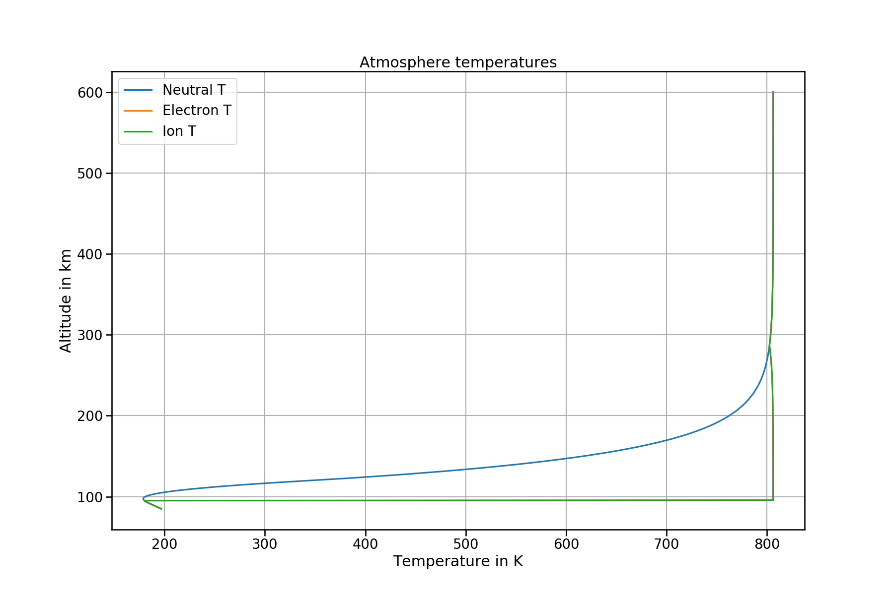
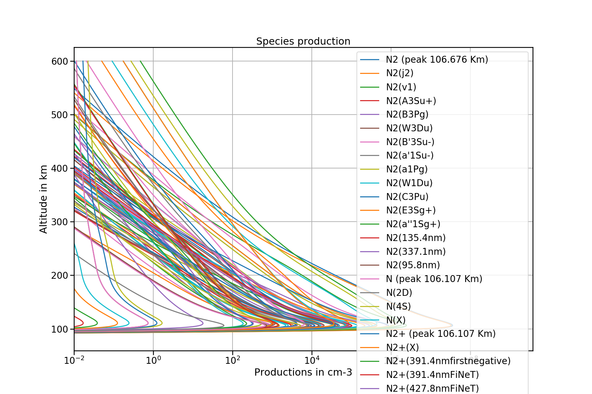
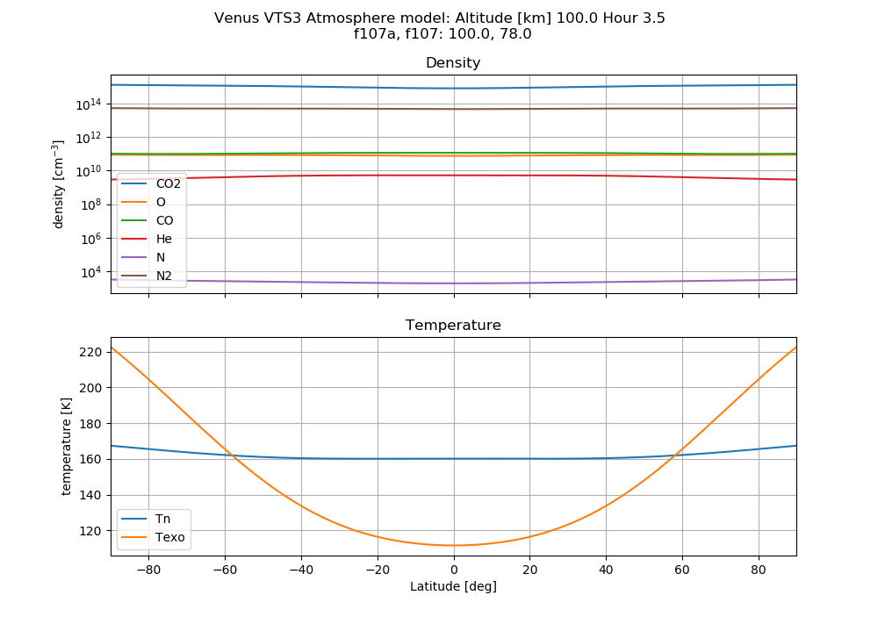
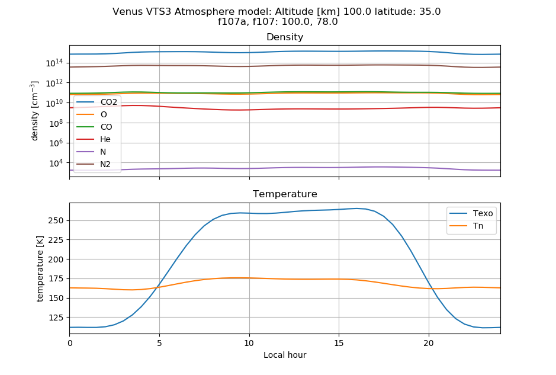
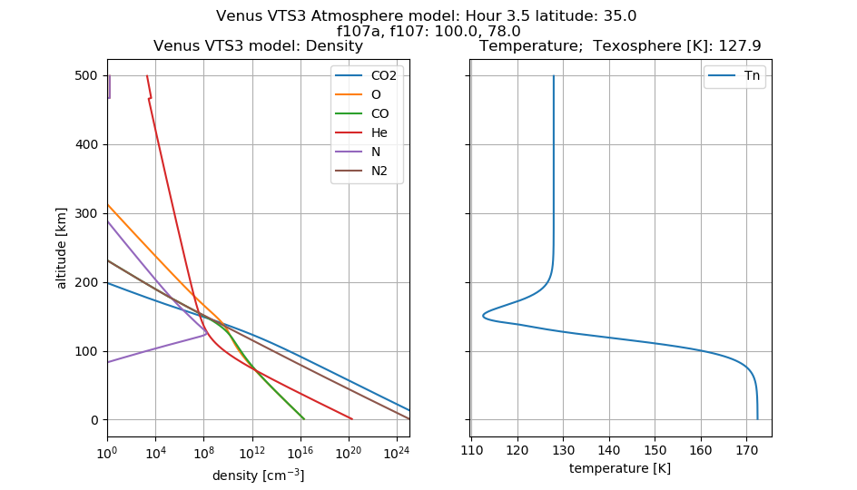

# Trans++: C++ implementation of the Trans* programs.


is from
[Guillaume Gronoff](https://scholar.google.com/citations?user=e2RfvmYAAAAJ)
([ORCID](https://orcid.org/0000-0002-0331-7076))
of NASA, a former student of Pierre-louis Blelly, Transcar author.
Michael Hirsch changed the broken autoconf build system to Cmake and redid the plotting utilities.


It builds easily with CMake.
It can be compared with other models like
[Glow](https://www.github.com/scivision/glowaurora) or
[Transcar](https://www.github.com/scivision/transcar).

The simulation is configured completely with XML.
The runtime is similar to Transcar (3-5 minutes on a laptop).
The output is text files, for which I have fast Python parsers that could dump to HDF5 etc. as desired.
Over 70 output files are created per simulation, covering production rates for numerous neutral and ion species, column emissions from UV to IR, energy grid from 1 eV ~ 30 keV, effects of secondary electroncs are considered.

Inputs include:
* photon flux (photoionization)
* proton flux (proton impact ionization)
* electron flux (electron impact ioniziation) -- parameterization or read your e- flux file.


## Prereqs

The build system is CMake as are widely used in software development.

* Mac:

    ```sh
    brew install cmake gcc boost lapack

    brew install doxygen  # optional
    ```
* Linux

    ```sh
    apt install g++ gfortran liblapack-dev libboost-filesystem-dev libboost-regex-dev

    apt install doxygen graphviz  # optional
    ```

    Then [install CMake](https://github.com/scivision/cmake-utils) via cmake_setup.py
* Windows: use [Windows Subsystem for Linux](https://www.scivision.dev/install-windows-subsystem-for-linux/)

Plotting uses Python and Matplotlib.

## Build

```sh
cmake -B build

cmake --build build -j2
```

Don't omit the `-j2` or the computer may crash during compile due to excess memory usage.

## Usage

NOTE: There is a bug where if the output directory doesn't exist,
the problem just keeps computing,
but doesn't write any output at all.

### Aurora example

From the aeroplanets/build/ directory:

0. create the output directory, or no files will be output at all despite full simulation run

   ```sh
   mkdir SortieAurora
   ```
1. run sim

   ```sh
   ./aero1d ../data/Earth/AuroraEarthFairbanks.xml
   ```
   the output appears under SortieAurora/


### Plot

Automatically iterates over all files in output directory.
From the aeroplanets/utils directory:

```sh
python Plot.py build/SortieAurora/
```

the optional `-p ~/plots` parameter saves plots to ~/plots/ directory.

`aeroplanets/data/Earth/SortieAuroraCompar/` is reference data to check if the compilation/computation was successful.











### Precipitation

Alfvenic aurora and other structured aurora users may be interested in configuring electron precipitation flux characteristics.
This is configured in the input XML file as follows:

1. `<use_precipitation />` must exist to enable electron precipitation, and the parameters are enclosed by `<precipitation>` `</precipitation>` XML tags.
2. Electron precipitation must be read from a file or computed by a simple parameterization.

`use_model`  (created in `math/mathflux.cpp`)

* 0: Null (none)
* 1: Maxwellian
* 2: Gaussian
* 3: Dirac (pseudo-monoenergetic)


* `E0`     Characteristic energy [eV]
* `entot`  Total flux [ergs]
* `isotro` 0: non-isotropic.  1: isotropic.
* `powlaw` power-law shaping 0 or 1


## Plotting
Several programs related to concurrent running of large numbers of simulations are in [utils/](./utils).
Most users will simply use `Plot.py` to make line plots of text output files, using headers.

Some examples from the
[1983 Venus VTS3 empirical model](https://doi.org/10.1029/JA088iA01p00073),
valid from about 140 km - 250 km altitude, done with Venus_*.py programs.





## Documentation

1. compile docs

   ```sh
   doxygen Doxyfile
   ```
2. web browser: `doc/html/index.html`
3. To create `/doc/latex/refman.pdf`:

   ```sh
   cd doc/latex
   make
   ```
